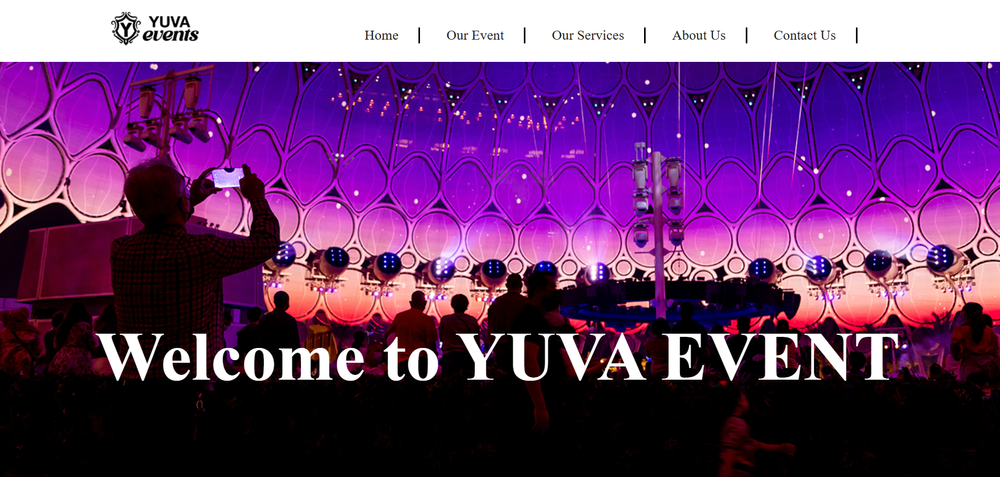
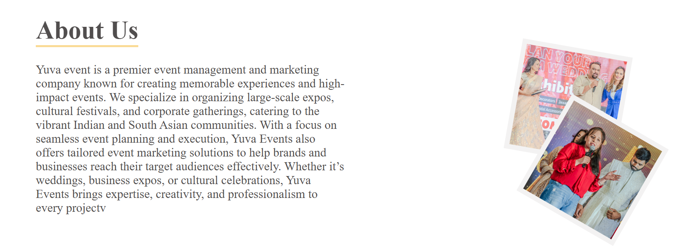
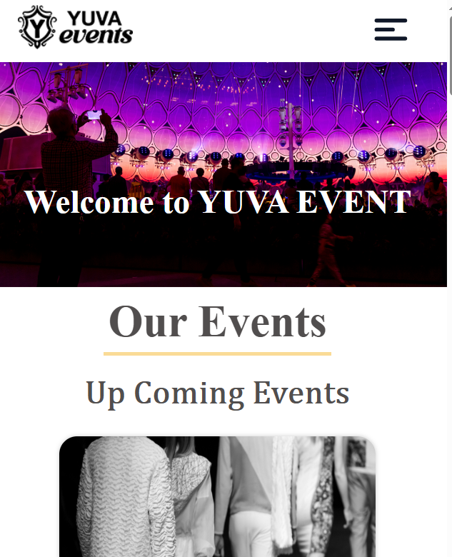
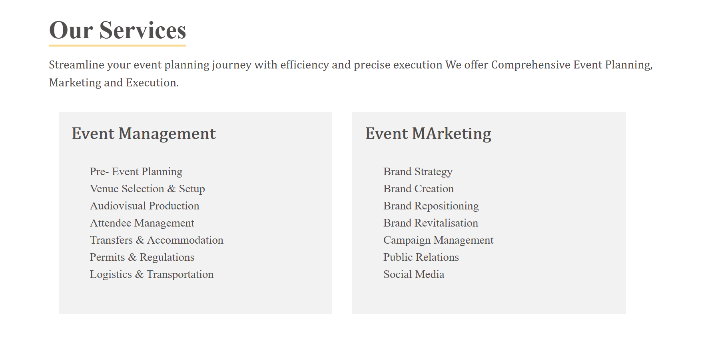

# 🎉 Yuva Event

A fully responsive Youth Event Management Website built using HTML, CSS, and JavaScript.

---

## 📌 Project Overview

Yuva Event is a modern and responsive website designed for organizing and showcasing youth events. It allows users to explore different events in an attractive and user-friendly interface. The project focuses on clean UI design and smooth user experience.

---

## 🚀 Technologies Used

* HTML5
* CSS3
* JavaScript

---

## ✨ Features

* Fully Responsive Design (Mobile + Desktop)
* Modern and Clean UI
* Event Listing Interface
* Easy Navigation System
* Smooth User Experience
* Cross Browser Compatible

---

## 📸 Website Preview

<h3>🏠 Home Section</h3>

<h3>ℹ️ About Section</h3>

<h3>📞 Contact Section</h3>

<h3>📞 Mobile Friendly Section</h3>

h3>🛠️ Our Event Section</h3>

h3>🛠️ Our Services Section</h3>

--- 

## 👨‍💻 Author

Sandeep Keshri
